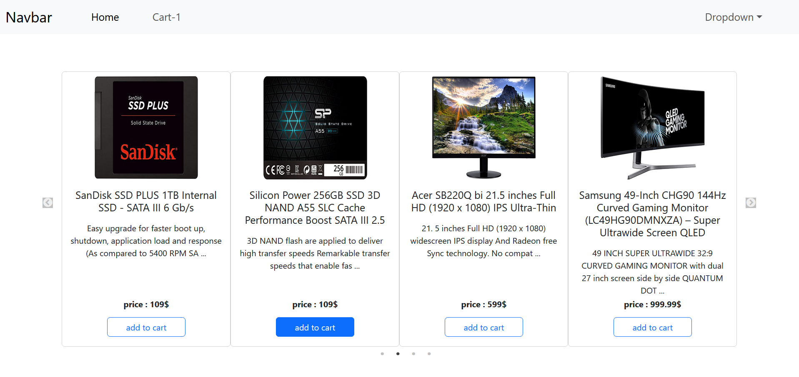
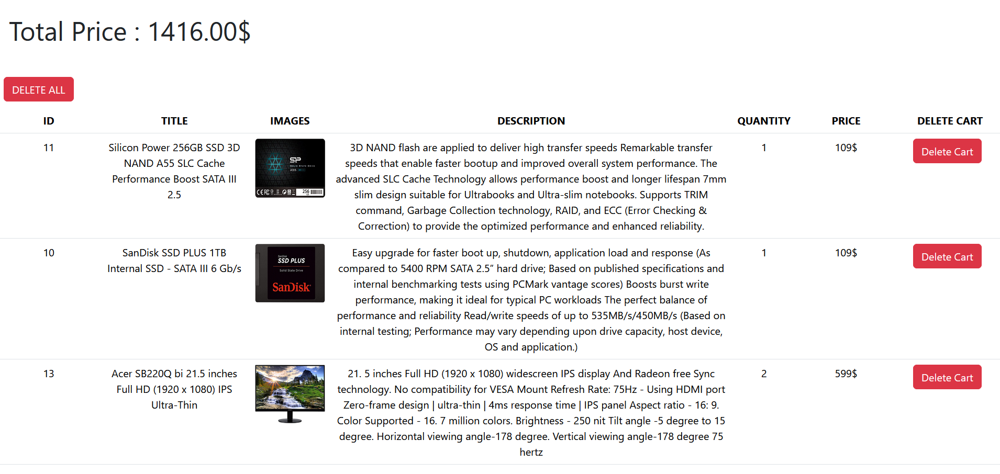
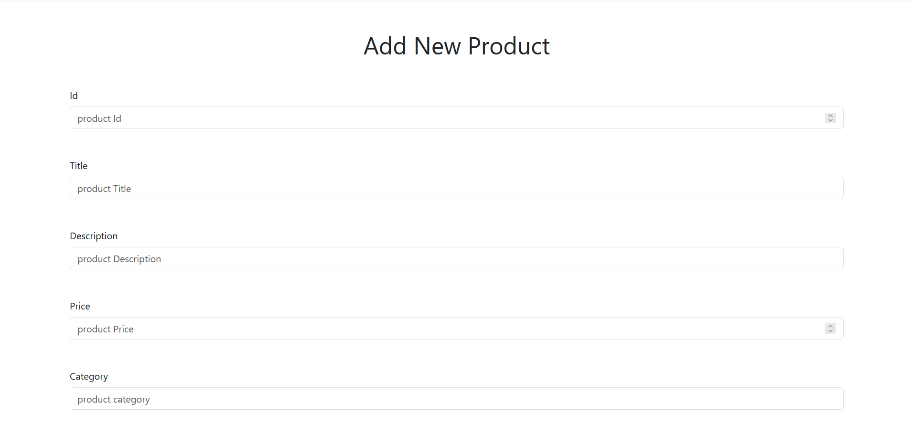
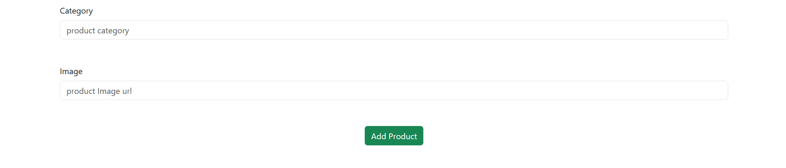
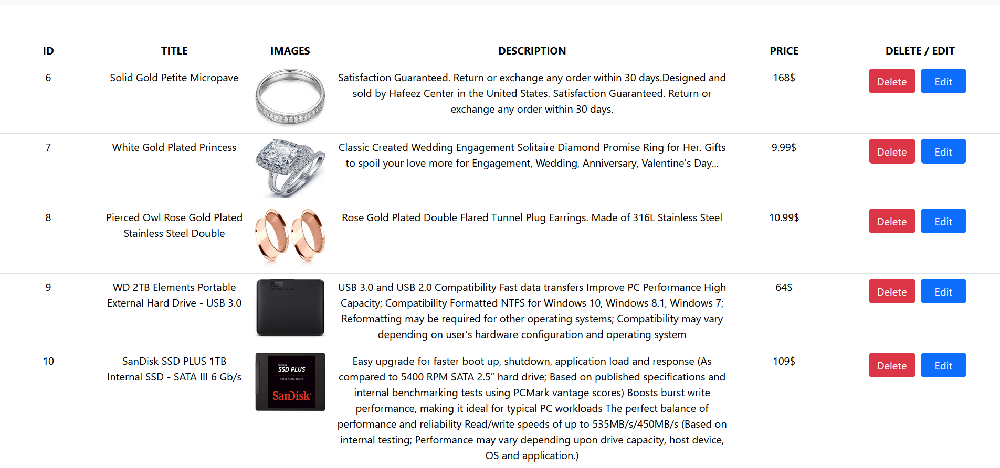
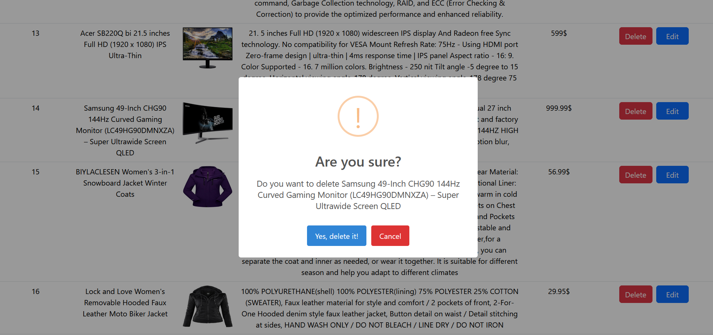

# React Redux MiniShop 

# Overview

Welcome to ReactReduxMiniShop, a streamlined E-Commerce application built with React and Redux. This application features product browsing, a shopping cart, and an admin panel for managing products. Designed with responsive layouts, it ensures a smooth experience on all devices. ReactReduxMiniShop integrates modern libraries like react-slick for carousels and SweetAlert2 for enhanced alerts, providing a user-friendly and efficient solution for small-scale online stores

## Features

- **Product Listing**: Displays a list of products with details such as title, description, price, and image.
- **Shopping Cart**: Allows users to add products to the cart, view cart items, and remove items from the cart.
- **Admin Panel**: Enables admin users to add, edit, and delete products.
- **Responsive Design**: Optimized for various screen sizes.
- **Slick Carousel**: Utilizes `react-slick` for a carousel display of products.
- **State Management**: Uses Redux for state management.

## Technologies Used

- **React**: Frontend library for building user interfaces.
- **Redux**: State management library.
- **React Router**: Library for routing.
- **Redux Toolkit**: Toolset for efficient Redux development.
- **Bootstrap**: CSS framework for responsive design.
- **Slick Carousel**: Carousel component.
- **SweetAlert2**: Library for beautiful alerts.

## Installation

1. Clone the repository:
   \`\`\`
   git clone https://github.com/Amin-Albouzan/React-Redux_MiniShop-.git
   cd React-Redux_MiniShop
   \`\`\`

2. Install dependencies:
   \`\`\`
   npm install
   \`\`\`

3. Start the development server:
   \`\`\`
   npm start
   \`\`\`

4. To run the mock API server, use json-server:
   \`\`\`
   json-server --watch data.json --port 7000
   \`\`\`

## Usage

### Viewing Products
- Navigate to the home page to see the list of available products.
- Click on "Add to Cart" to add a product to your shopping cart.
  

### Managing Cart
- Navigate to the cart page to view items in your cart.
- Use the "Delete Cart" button to remove items from the cart.
  

### Admin Panel

#### Add a New Product
- Navigate to the admin page.
- Use the "Add New Product" link to add a new product.
- Fill in the product details such as title, description, price, and image.
- Click "Save" to add the product to the list.
  

#### Edit and Delete Products
- Navigate to the admin page.
- To edit an existing product, click on the "Edit" button next to the product you wish to modify.
- Update the necessary product details and click "Save" to apply the changes.
- To delete a product, click on the "Delete" button next to the product you wish to remove
  

